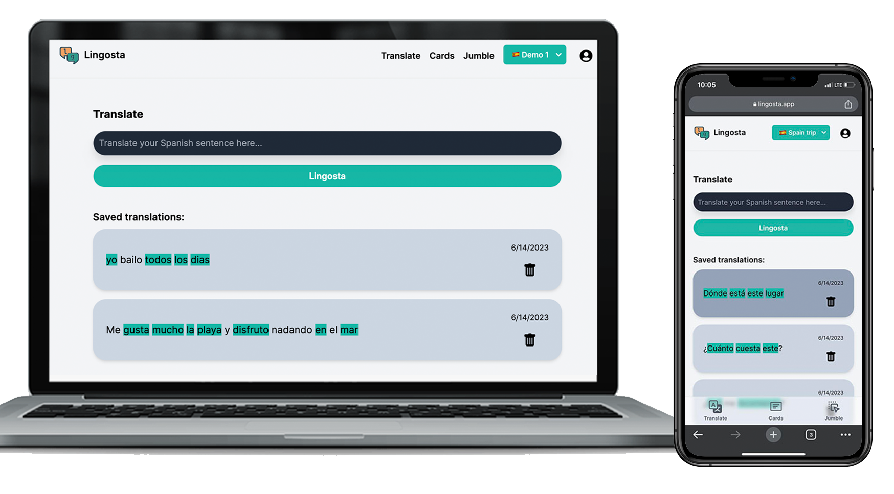

# Lingosta
Discover a personalized language-learning journey with Lingosta by using AI to generate curated exercises, making it more engaging for learners of all levels!

🇪🇸 🇧🇷 🇺🇸 🇰🇷 🇫🇷 🇩🇪 🇮🇹 🇳🇱 🇷🇺 🇨🇳 🇯🇵



## Prerequisites
* OpenAI account with API access
* Appwrite Cloud (bootstrap the database with `scripts`)

## Project Structure
* `app` contains the API and pages
* `components` contains React components
* `helpers` contains functions for app functionality
* `models` contains abstractions, mappers, and utils for Appwrite and application object models
* `providers` are essentially helpers but wrapped with React Context to handle state

## Development
This application is created with NextJS.

1. Set up your `.env` file.
1. Install dependencies
```bash
npm install
```
1. Start the application locally
```bash
npm run dev
```
